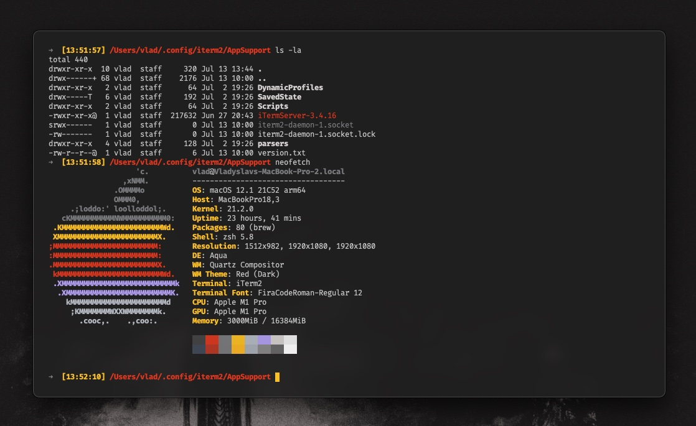

## 🚀 Usage

Under `General -> Preferences` choose to `Load preferences from a custom folder or URL`

- If you want to save your existing preferences:

- Save Current Settings to Folder button is inactive at first.
You have to check Load preferences from a custom folder or URL,
and choose an empty directory in order to save the preferences..
